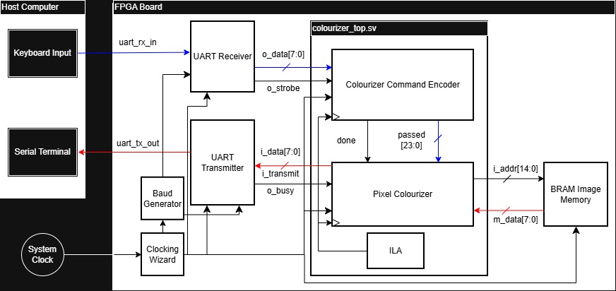

# Image-Colourizer---FPGA-Project
FPGA-based image colourizer.

## Overview
Multi-module FPGA-based image colourizer that reads grayscale image data from
BRAM, computes weighted RGB colour components from user input and streams pixel data
to a host computer over UART. The SystemVerilog design shown in the RTL folder
is the colourizer core, made up of the command_encoder module for interpreting user input 
from UART receiver, pixel_colourizer module for calculation of RGB weights, reading pixel 
data from memory, and "colouring" pixels. The system was successfully implemented on hardware.

## Design Principles
- FSM + Datapath RTL Design
- FSM-Controlled dataflow
- Backpressure and data flow control
- System-level RTL Architecture
- System-level Integration
- Hardware validation on FPGA

## Architecture

## Design/Implementation Tools
- SystemVerilog
- Vivado
- ILA
- Teraterm 
